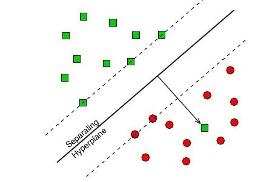

# SVM

SVM

SVM is a common classifier. In its basic form, it can just separate liner simple. And with the kernel trick, SVM can predict non-liner dataset.

## Basic theory

The SVM use two hyperplane to separate different category.

Hyperplane formula
$$
\min_{w,b}\ \ \ \frac{1}{2}||w||^2\\
s.t.\ \ \ y_i(w*x_i+b)-1\geq 0,\ \ \ i=1,2,...,N
$$

## SMO

future...

## KKT

future...

## Referenct

[SVM by python](https://blog.csdn.net/laobai1015/article/details/82763033)